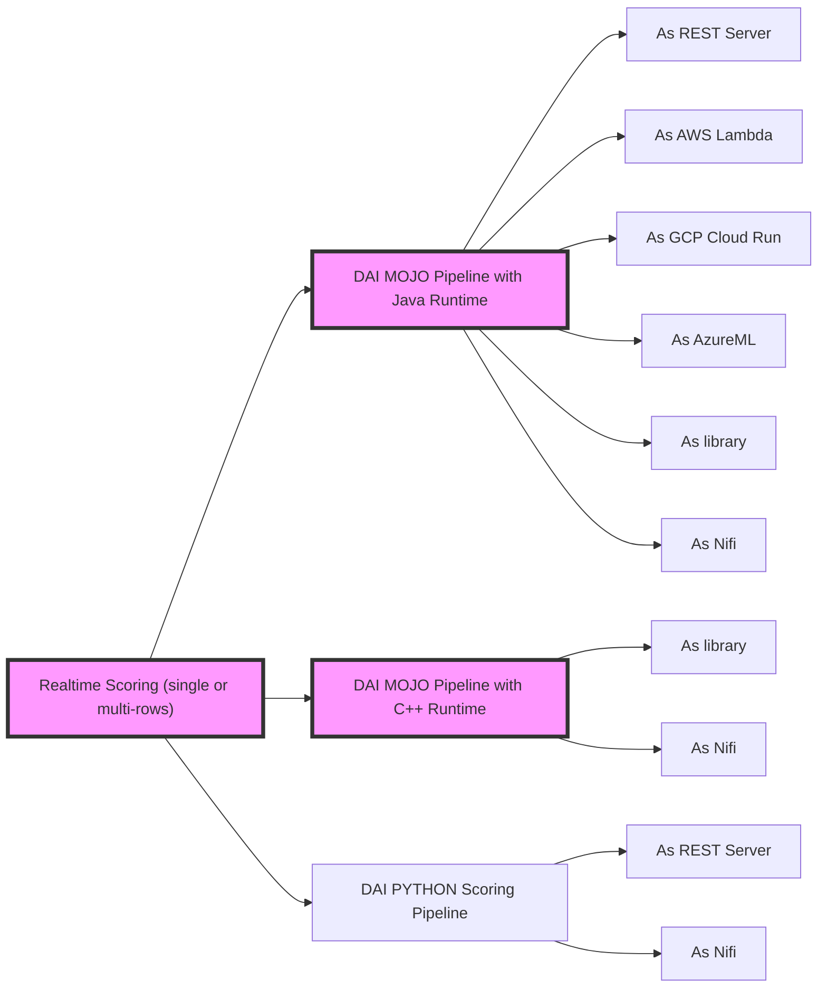
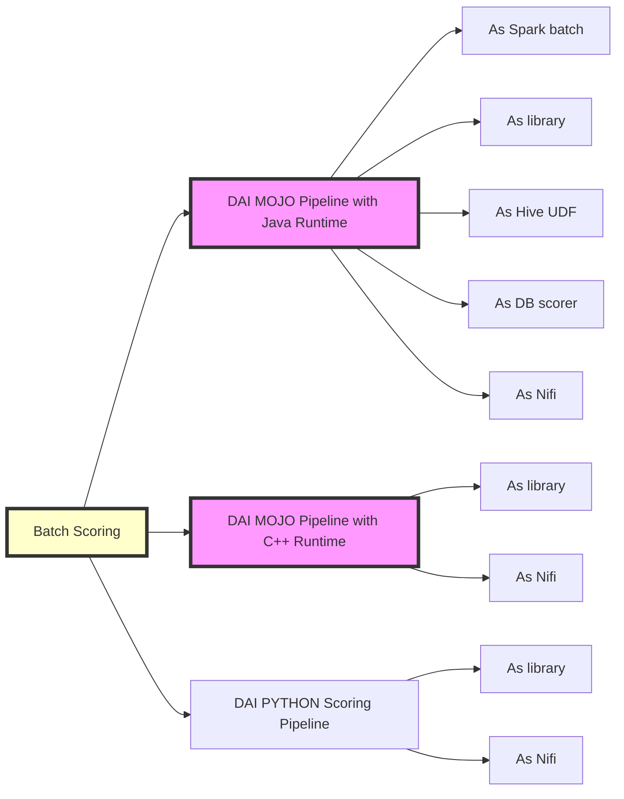
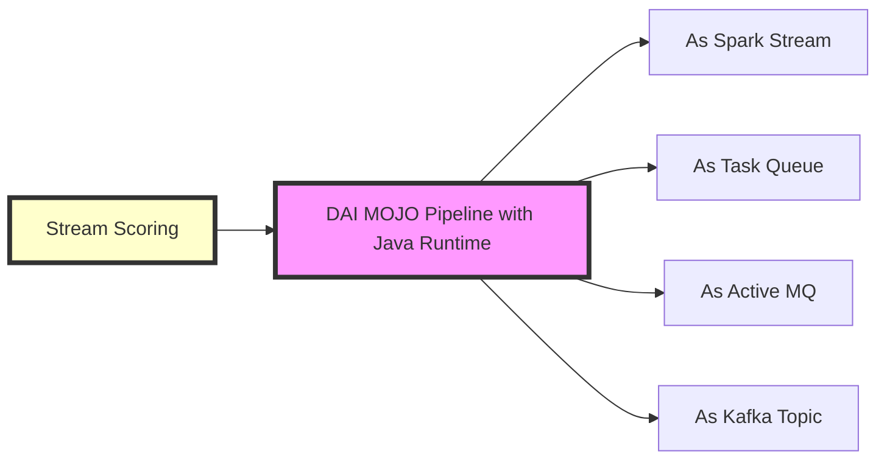

# Deploying Driverless AI Models to Production

This documentation lists some of the scenarios to deploy **[Driverless AI](http://docs.h2o.ai/driverless-ai/latest-stable/docs/userguide/index.html)** models to production and provides guidlines to create deployment templates for the same.

The final model from a Driverless AI experiment can be exported as either a  **[MOJO scoring pipeline](http://docs.h2o.ai/driverless-ai/latest-stable/docs/userguide/scoring-mojo-pipelines.html)** or a **[Python scoring pipeline](http://docs.h2o.ai/driverless-ai/latest-stable/docs/userguide/scoring-standalone-python.html)**. The Mojo scoring pipeline comes with a **pipline.mojo** file with a Java or C++ runtime. This can be deployed in **any** environment that supports Java or C++. The Python scoring pipeline comes with the scoring **whl** file for deployment purposes. 

Below, is a list of the deployment scenerios for Driverless AI pipelines for Real-time, Batch or Stream scoring.

